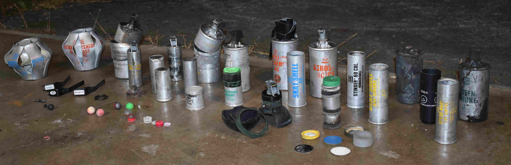

# Introduction {-}

(ref:munitionsspread) Chemical weapons recovered from Portland, OR, USA in 2020 [@munitionsspread]

```{r munitionsspread, echo=FALSE, out.width = 700, fig.cap="(ref:munitionsspread)", fig.align = "center", fig.alt = "A spread of chemical weapons types including grenades, shot shells, projectiles, and refuse like pins, clips, overshot wad, etc. There are two blast grenades, two stacks of triple chaer grenades, two tactile grenades, five full size grenades, 5 shot shells, two impact rounds, three shell inserts, a stack of skate shells for inserts, parts of a rubber ball grenade, a pile of colorful pogs, a range of pepperball, f303, rap4, and pround balls, and some other random stuff. it's all spread out nicely on a concrete garage floor with a driveway in the background, a few sprigs of dead grass poke up here and tehre."}

```

[Defense Technology](https://www.defense-technology.com/) is the predominate manufacturer of [chemical munitions](/munitions_library) we have recovered in Portland since May 2020 and their weapons are used by law enforcement agencies around the world.


Over the course of my work studying the environmental and human impacts of Defense Technology's weapons, I became interested in understanding what this company was all about, where they came from, and who was profiting off of it.
I started digging into their corporate structure and history, which turns out, is extensive and old, with tendrils reaching through Big Names in the weapons industry like the American classic [Smith and Wesson](https://en.wikipedia.org/wiki/Smith_%26_Wesson) and the British multinational [BAE](https://en.wikipedia.org/wiki/BAE_Systems) all the way back to the United States Army's Chemical Warfare Service.

This book is my attempt to wrestle this complex, confusing history into something understandable.

Buckle up, it's about to get wild.

