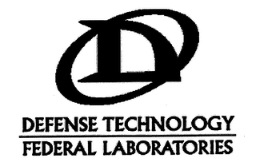

--- 
title: "Defense Technology Corporation of America, a Delaware Corporation that does Business in Wyoming, Not to be Confused with Defense Technology Corporation of America, a Wyoming Corporation that does Business in Wyoming"
subtitle: "An Incomplete Corporate History of the Chemical Weapons Industrial Complex"
author: "Dr. Juniper L. Simonis (they/them/theirs)"
date: "`r Sys.Date()`"
description: "The corporate history of chemical weapons industry leader, Defense Technology."
github-repo: "chemicalweaponsresearch/defense_technology"
url: "chemicalweaponsresearch.com/defense_technology"
colorlinks: yes
graphics: yes
bibliography: [packages.bib, references.bib]
biblio-style: apalike
link-citations: yes
knit: bookdown::render_book
site: bookdown::bookdown_site
---

```{r index-1, echo=FALSE}
is_on_ghactions = identical(Sys.getenv("GITHUB_ACTIONS"), "true")
is_online = curl::has_internet()
is_html = knitr::is_html_output()
```

```{asis index-2, echo=is_html}
#  {-}

```

(ref:DTFLlogo) DT & FL Trademark, expired 2013 [@DTFLlogo]

```{r DTFLlogo, echo=FALSE, out.width = 300, fig.cap="(ref:DTFLlogo)", fig.align = "center", fig.alt = "Black text and logo. logo is a capital D in a slanted oval that runs from the bottom left to the upper right of the letter. Underneath it are two names, one above a line, the other below, both in all caps: DEFENSE TECHNOLOGY  [line]  FEDERAL LABORATORIES"}

```


<br> 

```{asis index-3}

> This litigation involves two entities with confusingly similar names. The first is defendant Defense Technology Corporation of America ("DTC"), a Delaware corporation. It is a subsidiary of Armor Holdings, Inc., and does business in Casper, Wyoming. The second company is Defense Technology Corporation of America of Casper, Wyoming, ("DTC-Wyoming"), a Wyoming corporation. In 1996, DTC-Wyoming sold its assets to DTC. - [Hon. J. Rosenbaum, 2003](https://casetext.com/case/gamradt-v-federal-laboratories-inc-2)

```

```{r include=FALSE}

  # automatically create a bib database for R packages

  knitr::write_bib(c(.packages(), 'bookdown', 'knitr', 'rmarkdown'), 'packages.bib')

```